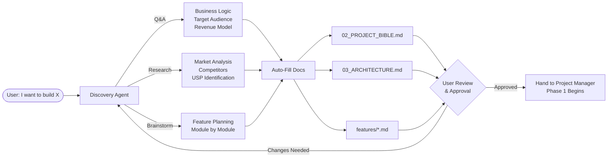
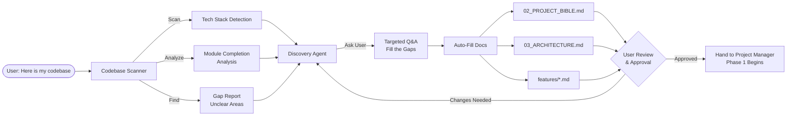

# AI-DOS (Agentic Operating System) — Whitepaper v3.0

---

## 🎯 What is AI-DOS?
AI-DOS is a portable, AI-agnostic framework that turns any AI model into a disciplined software development team. Copy the `.ai_framework/` folder into any project, point any AI to `00_MASTER.md`, and it will instantly understand the project, its rules, its history, and its workflow — even if it's the first time that AI has seen the project, or even if 6 months have passed.

### 5 Critical AI Failures That AI-DOS Solves
| # | AI Problem | AI-DOS Solution |
|---|-----------|----------------|
| 1 | **Hallucination** (Guessing instead of asking) | Anti-Hallucination rules + Internal Escalation to Librarian |
| 2 | **Scope Creep** (Adding unrequested features) | Context Guardian watchdog + Code Access restricted to Coder only |
| 3 | **Context Loss** (Forgetting past work) | Memory Cards for surgical recall, even months later |
| 4 | **Half-Cooked Code** (Breaking changes without rollback) | Git Sandboxing + Hard Rollback fail-safe |
| 5 | **User Fatigue** (Asking too many questions) | Autonomous execution with Internal Escalation |

---

## 📁 Framework Structure

```text
.ai_framework/
│
├── ai_docs/
│   ├── global/
│   │   ├── 00_MASTER.md                  (Entry Point & System Core)
│   │   └── 01_GLOBAL_RULES.md            (Immutable Rules & Standards)
│   │
│   └── project_specific/
│       ├── 02_PROJECT_BIBLE.md            (Vision, Goals, Business Logic)
│       ├── 03_ARCHITECTURE.md             (Tech Stack, Data Flow, APIs)
│       ├── 04_TASK_CONTEXT.md             (Current Task — Temporary)
│       ├── 05_CHANGELOG.md               (Version History)
│       └── features/
│           └── template_feature.md        (Per-Module Feature Docs)
│
├── sub_agents/
│   ├── 01_Project_Manager.md              15_Discovery_Agent.md
│   ├── 02_Librarian.md                    16_Codebase_Scanner.md
│   ├── 03_Architect.md
│   ├── 04_Task_Orchestrator.md
│   ├── 05_Coder.md
│   ├── 06_Context_Guardian.md
│   ├── 07_Reviewer.md
│   ├── 08_Tester.md
│   ├── 09_Documentation_Agent.md
│   ├── 10_Context_Memory_Agent.md
│   ├── 11_Release_Manager.md
│   ├── 12_Quality_Controller.md
│   ├── 13_Conflict_Detector.md
│   └── 14_Security_Auditor.md
│
└── tasks_management/
    ├── 01_WORKFLOW_REGISTRY.md             (Phase 0 + 7 Task Pipelines)
    ├── 02_AGENT_METRICS.md                (Performance Tracking)
    ├── 03_TASK_QUEUE.md                   (Priority-Based Task Backlog)
    └── memory_cards/
        └── template_memory_card.md        (Surgical Context History)
```

---

## 🧠 The Brain: 5-Layer Context System

AI ko kabhi poora project yaad nahi rakhna chahiye. Sirf jitni zaroorat ho utna context milna chahiye.

| Layer | File(s) | When Loaded |
|-------|---------|-------------|
| 1. Permanent | `USER_PREFS.md` | Always (First file loaded) |
| 2. Permanent | `01_GLOBAL_RULES.md` | Always (Every task) |
| 3. Project | `02_PROJECT_BIBLE.md`, `03_ARCHITECTURE.md` | Medium+ Tasks |
| 4. Feature | `features/auth.md`, `features/payments.md` | When relevant module is modified |
| 5. Task | `04_TASK_CONTEXT.md` | Always (Temporary, overwritten per task) |

---

## 🛠️ Pre-Phase: The Auto-Installer (Bootstrapping)

Zero-friction setup. The user simply copies the `.ai_framework` folder and tells the AI to "Read `README.md`". The AI acts as an Installer Agent and executes 4 steps before launching the system:
1. **Capability Check**: Ensures the AI can read/write local files (Agentic IDE).
2. **Language Memory**: Asks the user for their preferred language/tone and saves it permanently to `USER_PREFS.md`.
3. **Git Initialization**: Verifies and initializes Git for fail-safe rollbacks.
4. **Dependencies Setup**: Detects and installs project dependencies (e.g., `npm install`) for testing agents.

Once complete, the AI formally loads `00_MASTER.md` and hands control to Phase 0.

---

## 🔬 Phase 0: Discovery & Onboarding (The Brainstorming Engine)

This is the most unique feature of AI-DOS. Before a single line of code is written, the system helps the user validate their idea, plan their product, and auto-generate all project documentation.

### Mode A: New Project (From Scratch)



### Mode B: Existing / Half-Built Project



---

## 🤖 The Team: 16 Specialized Agents

### Phase 0 Agents (Discovery & Onboarding)
| # | Agent | Role | Code Access |
|---|-------|------|-------------|
| 15 | Discovery Agent | Interactive brainstorming, market analysis, auto-fills docs | ❌ |
| 16 | Codebase Scanner | Scans existing projects, detects tech stack & gaps | ❌ (Read-Only) |

### Phase 1 — Planning & Routing Layer
| # | Agent | Role | Code Access |
|---|-------|------|-------------|
| 1 | Project Manager | Classifies task, assigns Task ID, routes workflow | ❌ |
| 2 | Librarian | Retrieves precise context (docs + memory cards + feature docs) | ❌ |
| 3 | Architect | Impact analysis, implementation plans, edge cases | ❌ |
| 4 | Task Orchestrator | Git Sandbox, routing, rollbacks, queue, metrics, status updates | ❌ |

### Phase 1 — Execution & Quality Layer
| # | Agent | Role | Code Access |
|---|-------|------|-------------|
| 5 | Coder | The ONLY agent that writes code. Follows Architect's plan blindly | ✅ |
| 6 | Context Guardian 🛡️ | Watches for scope creep & hallucination. Can HALT workflow | ❌ |
| 7 | Reviewer | Code quality, bugs, regression. Generates structured Fix Reports | ❌ |
| 8 | Tester | Designs test cases & validation checklists | ❌ |
| 13 | Conflict Detector | Checks file conflicts between parallel sandboxes | ❌ |
| 14 | Security Auditor | SQL injection, XSS, hardcoded secrets, auth flaws | ❌ |

### Phase 1 — Governance & Memory Layer
| # | Agent | Role | Code Access |
|---|-------|------|-------------|
| 9 | Documentation Agent | Keeps PROJECT_BIBLE, ARCHITECTURE, CHANGELOG synced | ❌ |
| 10 | Context Memory Agent | Generates tiny Memory Cards after each task | ❌ |
| 11 | Release Manager | Compiles release notes & deployment notes | ❌ |
| 12 | Quality Controller | Final gatekeeper. PASS, Fix Report, or Fatal Reject | ❌ |

---

## 🔄 7 Task Types (Phase 1)

| Type | Name | Risk | Human Approval | Key Agents |
|------|------|------|---------------|------------|
| 🟢 1 | Tiny Task | Lowest | ❌ No | Coder → Reviewer |
| 🔵 2 | Small Task | Low | ❌ No | Architect → Coder → Reviewer |
| 🟡 3 | Medium Feature | Medium | ✅ Yes (1x) | Full pipeline + Guardian + Security |
| 🔴 4 | Large Feature | High | ✅ Yes (1x) | Full pipeline + Release Manager |
| 🟣 5 | Architecture Change | Critical | ✅ Yes (2x) | Full pipeline + Double Human Approval |
| ⚫ 6 | Emergency Bug | Urgent | ❌ No | Fast-track + Security + Memory |
| ⚪ 7 | Refactor | Low | ❌ No | Coder → Reviewer → Tester (Regression) |

---

## 🛡️ 8 Fail-Safe Superpowers

### 1. Git Sandboxing (Universal)
Every task — even a tiny text change — runs in an isolated `sandbox` branch. Main code is never touched until QC passes.

### 2. Hard Rollback
If Guardian catches hallucination or QC issues Fatal Reject → Orchestrator deletes the sandbox branch. Project returns to pristine state.

### 3. Feedback Loop (Iterative Self-Correction)
QC or Reviewer doesn't reject the ENTIRE task. They generate a **Fix Report** specifying exactly what's wrong and which agent caused it. Orchestrator routes it back to that specific agent only. Hard Rollback only triggers after 3 failed attempts.

### 4. Internal Escalation (No User Disturbance)
Confused agents ask the **Librarian** for more context — NOT the user. User is only queried by PM at the very start if the prompt is incomplete.

### 5. Discussion Mode (Human Approval Gate)
For Medium+ tasks, execution is locked until user approves the Architect's impact analysis. No code is written without a mutually agreed foolproof plan.

### 6. Cherry-Picking & Partial Rollback
Memory Cards store exact file changes per task. User can say "undo Task 506" or "revert login buttons to 4 weeks ago" and AI will surgically revert only those specific changes.

### 7. Conflict Detection
Before coding starts, the Conflict Detector checks if any other active sandbox is modifying the same files. Prevents merge conflicts in parallel execution.

### 8. Security Auditing
Dedicated Security Auditor scans for vulnerabilities after code review, before QC approval.

---

## 📊 Operational Intelligence

### Agent Performance Metrics
Every task updates `02_AGENT_METRICS.md` with retry counts, fix reports received, and success rates. Identifies bottleneck agents.

### Task Queue (Priority System)
Multiple tasks are managed in `03_TASK_QUEUE.md`:
- 🔴 CRITICAL → Process Immediately
- 🟠 HIGH → Process Next
- 🟡 MEDIUM → Process In Order
- 🟢 LOW → Process When Free

### Real-Time User Status Updates
Orchestrator sends milestone notifications at every phase transition.

---

## 🔄 Complete System Workflow (Phase 0 + Phase 1)

```mermaid
graph TD
    Start([Project Begins]) --> Mode{New Project <br/> or Existing?}
    
    subgraph Phase 0: Discovery & Onboarding
    Mode -->|New| Discovery[Discovery Agent <br/> Business Q&A <br/> Market Analysis <br/> Feature Brainstorm]
    Mode -->|Existing| Scanner[Codebase Scanner <br/> Tech Detection <br/> Gap Report]
    Scanner --> Discovery
    Discovery -->|Auto-Fill| Docs[PROJECT_BIBLE <br/> ARCHITECTURE <br/> Feature Docs]
    Docs --> P0Approval{User Reviews <br/> & Approves Docs}
    P0Approval -->|Changes| Discovery
    P0Approval -->|Approved| Phase1Start([Phase 1 Ready])
    end

    Phase1Start --> User([User Task Prompt])
    User --> PM[Project Manager <br/> Task Classifier <br/> Assigns TASK_ID]
    
    subgraph Phase 1: Development Workflow
    PM -->|Incomplete| User
    PM -->|Task Type + Docs List| Queue[Task Queue]
    Queue --> Librarian[Librarian Agent]
    Librarian -->|Search| Context[(Project Bible <br/> Feature Docs <br/> Memory Cards)]
    Context --> Librarian
    Librarian -->|Relevant Context| Architect[Architect Agent]
    Architect --> HumanGate{Human Approval <br/> Required?}
    HumanGate -->|Yes: Discussion Mode| User
    HumanGate -->|No / Approved| Orchestrator[Task Orchestrator <br/> Create Sandbox]
    Orchestrator --> ConflictCheck[Conflict Detector]
    ConflictCheck --> Coder[Coder Agent]
    Guardian[Context Guardian 🛡️] -.->|Parallel Monitor| Coder
    Guardian -.->|Halt + Rollback| Orchestrator
    Coder --> Reviewer[Reviewer]
    Reviewer -->|Fix Report| Orchestrator
    Reviewer -->|OK| Security[Security Auditor]
    Security -->|Fix Report| Orchestrator
    Security -->|Clear| Tester[Tester]
    Tester --> QC[Quality Controller]
    QC -->|Fix Report Loop| Orchestrator
    QC -->|Fatal Reject| Rollback[Hard Rollback]
    QC -->|PASS| Memory[Memory Agent]
    Memory --> DocAgent[Documentation Agent]
    DocAgent --> Release[Release Manager]
    Release --> Merge[Orchestrator: Merge]
    Merge --> Metrics[Update Metrics]
    Metrics --> Status[User Status ✅]
    Status --> Done([Task Complete])
    end
```



---

## 🚀 Portability & Compatibility
This framework is **100% AI-agnostic**. It works with:
- ✅ ChatGPT / OpenAI
- ✅ Claude / Anthropic
- ✅ Gemini / Google
- ✅ GitHub Copilot
- ✅ Any future AI model

Simply copy `.ai_framework/` into any project and instruct the AI: *"Read `00_MASTER.md` first."*

---

*AI-DOS v3.0 — Designed & Architected collaboratively.*
